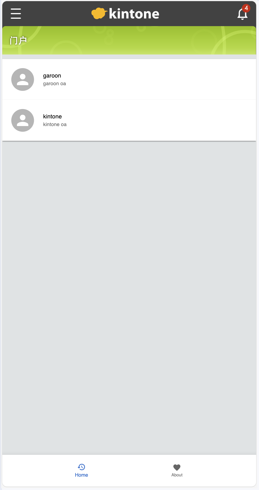

# React + TypeScript + Vite + kintone + material-ui

This is a kintone mobile customize demo. It uses Vite as the development build tool.
kintone vite plugin : [vite-plugin-kintone-dev](https://github.com/GuSanle/vite-plugin-kintone-dev)  
npm: npm i -D vite-plugin-kintone-dev  
This project use : React + TypeScript + Vite + kintone + material-ui

## Setp

1. Import the kintone-template(Goods list.zip) to your kintone.
2. Add some demo records
3. Navigate to your project directory: cd [your porject]
4. Install the project dependencies:

```
pnpm install
```

5. Start the development server:

```
pnpm run dev
```

6. Follow the on-screen guide to automatically generate the .env.development file.
7. Update the .env.development file and add the kintone application ID for the “Goods list” app:

```
VITE_APP_ID=xx
```

## Plugin Information

For more details about the vite-plugin-kintone-dev, visit the GitHub repository:
[vite-plugin-kintone-dev](https://github.com/GuSanle/vite-plugin-kintone-dev)


